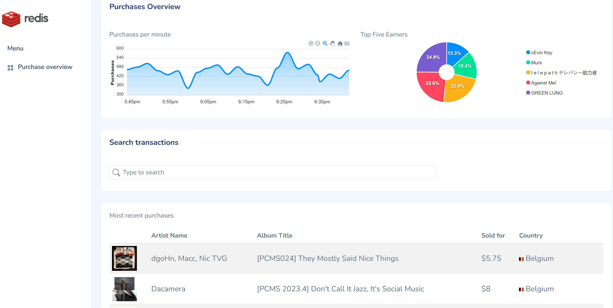

# Beats-By-Redis



This repository uses Redis core data structures, Streams, JSON, Search and TimeSeries to build a Node.js Express Redis Reactive application that uses the Bandamp Sales API to get recent sales and simulate streaming in real time. UI in Bootstrap/CSS/Vue.

Features in this demo:

-   Redis Streams for the realtime sales data
-   Redis TimeSeries for the balance over time
-   JSON & Query for searching artists to find sales
-   Sorted Sets for the 'top sellers'
-   JSON for authentication, session storage, and purchases


## Purchase Generator

The purchase generator reads in sales and purchases from the Bandcamp Sales API and simulates streaming them into Redis in real time. The Bandcamp Sales API provides a list of sales, where each sale has it's own list of purchasers. Put another way, a "sale" corresponds to the shopping cart for a user, and each "purchase" is an item in the cart, either an album or a track. Here is an example of the purchase information:

```json
{
    "utc_date": 1691166738,
    "artist_name": "𝐺𝑂𝑅𝐸",
    "item_type": "p",
    "item_description": "Limited Edition Cassette",
    "album_title": "肉と血を超えて",
    "slug_type": "a",
    "track_album_slug_text": "null",
    "currency": "USD",
    "amount_paid": 12,
    "item_price": 12,
    "amount_paid_usd": 12,
    "country": "United States",
    "art_id": "null",
    "releases": "null",
    "package_image_id": "33093824",
    "url": "//celadonplaza.bandcamp.com/album/--12",
    "country_code": "us",
    "amount_paid_fmt": "$12.50",
    "art_url": "http: /f4.bcbits.com/img/0033093824_37.jpg",
    "utc_date_raw": 1691166738.7452447
}
```

In Beats-By-Redis, purchase information is saved as a JSON document in Redis. Each sale is recorded in a `sales_ts` timeseries.

## Session Storage and Authentication

Beats-By-Redis allows account registration and login in order to stream purchases and see top spenders. The account information is stored as a JSON document in Redis and uses an authentication token refresh token. The account JSON looks as follows:

```json
{
"tokenExpiresOn": 1691169643.241
"refreshExpiresOn": 1701534043.242
"userId": "01H6YHTCNRVT8QEB60ES7YG8XW"
}
```

Session storage is also handled through Redis with the package [Connect Redis Stack](https://www.npmjs.com/package/connect-redis-stack). Once logged in, a session JSON object is stored with a TTL (time to live) set to 3600 seconds, or one hour. The authentication and refresh tokens are stored in the session, in an `HttpOnly` cookie only accessible by the server. The session JSON looks as follows:

```json
{
    "tokenExpiresOn": "2023-08-04T17:20:43.241Z",
    "refreshExpiresOn": "2023-12-02T16:20:43.242Z",
    "token": "aOqWK4mSxyY0FDx9JETJ3DW2jSBd3JZmwbMZLvCv5hatBAlkc2RlGh8k/Zs8o8KnYfOpTUEJHg4GLcXdTjdvELbOA6mVdLlVvTGp0dLh5Ta0A0mY+ppjh6BzR/5wgYpk0WGGlgR/",
    "refresh": "Z2rNxDI8JSQNRBIYTLsrr6I8hBFUQii1UL4cFjreE/PF0lwwbO47hqPQbrFtXMEamE5hqjqkBaHjMzJaM7k8t22thbw33HuQOI+TZLrsjM0ZY+kf71oI1mwgiz9a2lRYFpno6cCtrGZC/PYg9ylAsJ2n9C1wacDP4bZnsn02LhusS1xfDapnJrjZsEQYlf382BRr5jx6375GoBb9lSCu/MmNbqzWs9tPYhxBdgLtvG+gXY4HOOdAYL6wK2Z/Ry3fbDseBySnmcpYQLss22jtkMqtNRfO"
}
```

## Purchases API

Beats-By_redis provides an API for the timeseries chart to track sales history, a pie chart of the top five earners, a search endpoint to return specific purchases for artists or by country, and a list of the most recent purchases. A websocket connection provides the most purchases in real time, as well as top spenders and purchase history every minute.

### Search API

|                  |                                                |
| ---------------- | ---------------------------------------------- |
| Endpoint         | `/purchases/search`                            |
| Code Location    | `/app/components/purchases/purchase-router.js` |
| Query Parameters | term                                           |
| Return value     | array of results matching term                 |

The search endpoint receives a `term` query parameter from the UI. A Redis Om query is used to match the `term` to one of the fields: `artist_name`, `album_title`, `item_description`, and `country`. The most recent purchases matching the `term` will be returned, up to 10.

### History API

|               |                                                |
| ------------- | ---------------------------------------------- |
| Endpoint      | `/purchases/history`                           |
| Code Location | `/app/components/purchases/purchase-router.js` |
| Parameters    | none                                           |
| Return value  | `[{x: timestamp, y: value}, ...]`              |

The history endpoint returns the range of all values from the timeseries object `sales_ts`. The resulting range is converted to an array of objects with each object containing an `x` property containing the timestamp and a `y` property containing the associated value. This endpoint supplies the timeseries chart with coordinates to plot a visualization of the sales over time.

### Top Sellers API

|               |                                                |
| ------------- | ---------------------------------------------- |
| Endpoint      | `/purchases/top-sellers`                       |
| Code Location | `/app/components/purchases/purchase-router.js` |
| Parameters    | none                                           |
| Return value  | `{labels:[...], series:[...] }`                |

The top sellers endpoint retrieves the top 5 members of the sorted set `top-sellers`. The top five or less are returned to provide the UI pie chart with data. The labels array contains the names of the top sellers and the series array contains the numeric values associated with each member name.

### Purchases Websocket

The Websocket connection streams the real time purchase information to each socket connection (client) as it is processed from Redis Streams. It also sends the purchase history and top sellers information once per minute. This allows the clients to get the most up-to-date purchase information, and routine updates to both charts.
